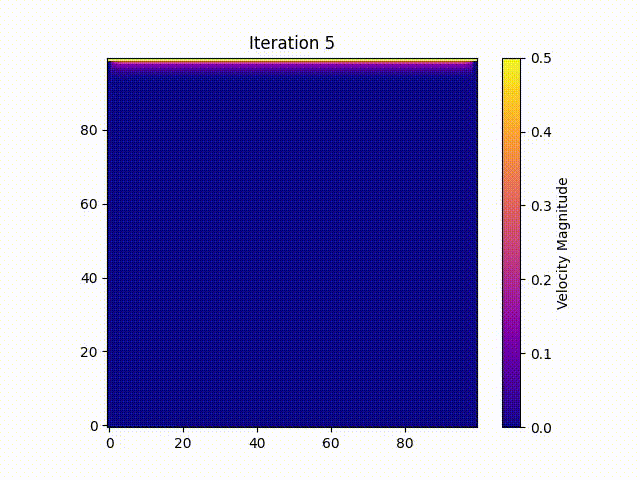

# Hands-on Group 11: Lattice Boltzmann Methods 
### Introduction and objectives
This projects uses the Lattice Boltzmann Methods (LBM) to perform a 2D fluid simulation with the D2Q9 model. Specifically, the aim was to solve the 2D lid-driven cavity problem.


### Building the Project

To build the project using CMake, follow these steps:

1. Clone the repository and navigate to the main directory.
2. Run the following commands:

   
   ### Create a directory for build files
   ```bash
   mkdir build
   ```

   
   ### Enter the build directory
   ```bash
   cd build
   ```
  
   ### Generate configuration files
   ```bash
   cmake ..
   ```
    
   ### Build the project
   ```bash
   cmake --build .
   ```


### Parallelization Strategy
We parallelized the code using OpenMP. The main bottleneck in the computation is represented by a single nested for-loop. The code was written so that each iteration was completely independent from the others and so that they all could be executed in parallel. To achieve this we needed to *bufferize* the whole computation so that two sets of memory location were used and then swapped for each iteration.
We observed a significant improvement in computation time.

#### Strong scalability test
We tested how our code performed wrt the number of threads (and fixed cavity size).

The following table contains the execution times recorded on a pc with 6 cores and 12 threads.
The simulation has been run for 10'000 iterations.
| Threads | Time (ms) | Speedup       | Efficiency    |
|---------|-----------|---------------|---------------|
| 1       | 69187     | 1.00          | 1.00          |
| 2       | 38153     | 1.81          | 0.91          |
| 3       | 29987     | 2.31          | 0.77          |
| 4       | 27700     | 2.50          | 0.63          |
| 5       | 24697     | 2.80          | 0.56          |
| 6       | 22624     | 3.06          | 0.51          |
| 7       | 19980     | 3.46          | 0.49          |
| 8       | 17710     | 3.91          | 0.49          |
| 9       | 16086     | 4.30          | 0.48          |
| 10      | 14747     | 4.69          | 0.47          |
| 11      | 14664     | 4.72          | 0.43          |
| 12      | 18187     | 3.80          | 0.32          |

The following table contains the execution times recorded on a pc with 8 cores and 8 threads
The simulation has been run for 10'000 iterations.
| Threads | Time (ms) | Speedup       | Efficiency    |
|---------|-----------|---------------|---------------|
| 1       | 53929     | 1.00          | 1.00          |
| 2       | 31645     | 1.70          | 0.85          |
| 3       | 23348     | 2.31          | 0.77          |
| 4       | 19208     | 2.81          | 0.70          |
| 5       | 16473     | 3.27          | 0.65          |
| 6       | 15139     | 3.56          | 0.59          |
| 7       | 13518     | 3.99          | 0.57          |
| 8       | 25401     | 2.12          | 0.27          |


#### Weak scalability test
todo

### Validation of Results
We were provided with some reference data to compare our results.
The following tables, for instance, allows to compare the y-component of the velocity of the fluid along the vertical line through the geometrical center of the cavity.  

It can be observed that although the results with Re = 100 are relatively accurate, there's an error build-up with toward the lower part of the cavity and with increasing Reynolds numbers. That can probably be caused by slightly different parameters and formulae used. We are confident that our code works as intended and that, with some tweaking, we could allign our results with the reference data.


#### Our results
| 129-grid pt. no. | y       | Re (100)  | Re (400)  | Re (1000) |
|------------------|---------|-----------|-----------|-----------|
| 129              | 1.00    | 1         | 1         | 1         |
| 126              | 0.98    | 0.844576  | 0.759886  | 0.654879  |
| 125              | 0.97    | 0.792432  | 0.68533   | 0.56604   |
| 124              | 0.96    | 0.741241  | 0.6171    | 0.496168  |
| 123              | 0.95    | 0.691354  | 0.556289  | 0.44422   |
| 110              | 0.85    | 0.222347  | 0.262017  | 0.295701  |
| 95               | 0.74    | -0.01649  | 0.141458  | 0.163419  |
| 80               | 0.62    | -0.1383   | 0.004383  | 0.042401  |
| 65               | 0.50    | -0.17906  | -0.13328  | -0.0651   |
| 59               | 0.46    | -0.17623  | -0.18906  | -0.10638  |
| 37               | 0.29    | -0.12114  | -0.27501  | -0.2716   |
| 23               | 0.18    | -0.07795  | -0.16957  | -0.31972  |
| 14               | 0.11    | -0.04994  | -0.09319  | -0.20474  |
| 10               | 0.08    | -0.03668  | -0.06236  | -0.14069  |
| 9                | 0.07    | -0.03321  | -0.05479  | -0.1247   |
| 8                | 0.06    | -0.02968  | -0.04723  | -0.10798  |
| 1                | 0.00    | 0         | 0         | 0         |


#### Reference data
| 129-grid pt. no. | y      | Re (100)  | Re (400)  | Re (1000) |
|------------------|---------|-----------|-----------|-----------|
| 129              | 1.00000 | 1.00000   | 1.00000   | 1.00000   |
| 126              | 0.9766  | 0.84123   | 0.75837   | 0.65928   |
| 125              | 0.9688  | 0.78871   | 0.68439   | 0.57492   |
| 124              | 0.9609  | 0.73722   | 0.61756   | 0.51117   |
| 123              | 0.9531  | 0.68717   | 0.55892   | 0.46604   |
| 110              | 0.8516  | 0.23151   | 0.29093   | 0.33304   |
| 95               | 0.7344  | 0.00332   | 0.16256   | 0.18719   |
| 80               | 0.6172  | -0.13641  | 0.02135   | 0.05702   |
| 65               | 0.5000  | -0.20581  | -0.11477  | -0.06080  |
| 59               | 0.4531  | -0.21090  | -0.17119  | -0.10648  |
| 37               | 0.2813  | -0.15662  | -0.32726  | -0.27805  |
| 23               | 0.1719  | -0.10150  | -0.24299  | -0.38289  |
| 14               | 0.1016  | -0.06434  | -0.14612  | -0.29730  |
| 10               | 0.0703  | -0.04775  | -0.10388  | -0.22220  |
| 9                | 0.0625  | -0.04192  | -0.09266  | -0.20196  |
| 8                | 0.0547  | -0.03717  | -0.08186  | -0.18109  |
| 1                | 0.0000  | 0.00000   | 0.00000   | 0.00000   |

#### Error wrt the reference data
| 129-Grid pt. no. | y    | Re (100)    | Re (400)    | Re (1000)   |
|------------------|------|-------------|-------------|-------------|
| 129              | 1.00 | 0.000000    | 0.000000    | 0.000000    |
| 126              | 0.98 | 0.003346    | 0.001516    | -0.004401   |
| 125              | 0.97 | 0.003722    | 0.000940    | -0.008880   |
| 124              | 0.96 | 0.004021    | -0.000460   | -0.015002   |
| 123              | 0.95 | 0.004184    | -0.002631   | -0.021820   |
| 110              | 0.85 | -0.009163   | -0.028913   | -0.037339   |
| 95               | 0.74 | -0.019810   | -0.021102   | -0.023771   |
| 80               | 0.62 | -0.001890   | -0.016967   | -0.014619   |
| 65               | 0.50 | 0.026750    | -0.018510   | -0.004300   |
| 59               | 0.46 | 0.034670    | -0.017870   | 0.000100    |
| 37               | 0.29 | 0.035480    | 0.052250    | 0.006450    |
| 23               | 0.18 | 0.023550    | 0.073420    | 0.063170    |
| 14               | 0.11 | 0.014400    | 0.052930    | 0.092560    |
| 10               | 0.08 | 0.011070    | 0.041520    | 0.081510    |
| 9                | 0.07 | 0.008710    | 0.037870    | 0.077260    |
| 8                | 0.06 | 0.007490    | 0.034630    | 0.073110    |
| 1                | 0.00 | 0.000000    | 0.000000    | 0.000000    |


### Gallery

#### Re=100 on a 100x100 cavity


#### Re=10000 on a 100x100 cavity

